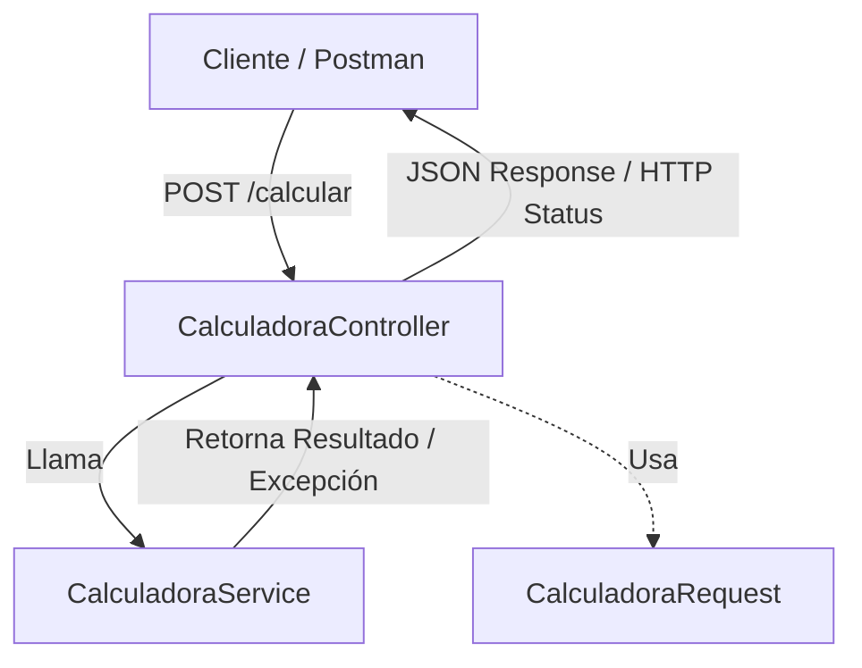

# 🧮 Calculadora Spring Boot API

Este proyecto es una aplicación web y API REST desarrollada con **Spring Boot** que implementa una calculadora aritmética básica. Proporciona un endpoint RESTful para realizar operaciones matemáticas y cuenta con una arquitectura limpia basada en controladores y servicios, además de una suite de pruebas unitarias.

---

## 🛠️ Tecnologías y Dependencias

El proyecto está construido con las siguientes tecnologías:

*   **Java 17** (Versión de Java configurada)
*   **Spring Boot 4.0.3** (Framework base)
*   **Spring Web MVC** (Para la creación de endpoints REST)
*   **Lombok** (Para reducir el código boilerplate de getters, setters y constructores)
*   **JUnit 5 & Mockito** (Para la suite de pruebas unitarias y mocks)
*   **Maven** (Gestor de dependencias y automatización de compilación)

---

## 📂 Arquitectura del Proyecto

El código está organizado de manera limpia siguiendo la arquitectura estándar en capas de Spring:



### Componentes Principales

1.  **`CalculadoraRequest` (`entities/`)**:
    *   Clase DTO (Data Transfer Object) anotada con Lombok (`@Getter`, `@Setter`, `@ToString`, `@AllArgsConstructor`, `@NoArgsConstructor`).
    *   Atributos:
        *   `operation` (String): El operador aritmético (`+`, `-`, `*`, `/`).
        *   `n1` (Double): Primer operando.
        *   `n2` (Double): Segundo operando.

2.  **`CalculadoraService` (`services/`)**:
    *   Contiene la lógica de negocio de la aplicación.
    *   Método `calcular(String operacion, double n1, double n2)`:
        *   Suma (`+`)
        *   Resta (`-`)
        *   Multiplicación (`*`)
        *   División (`/`): Valida que el divisor no sea cero. Si es cero, lanza `NumberFormatException`.
    *   Lanza `NumberFormatException` si la operación no es válida o si ocurre una división por cero.

3.  **`CalculadoraController` (`controllers/`)**:
    *   Controlador REST expuesto bajo la anotación `@RestController`.
    *   Usa inyección de dependencias por constructor para el `CalculadoraService`.
    *   Maneja las excepciones capturando `NumberFormatException` y retornando códigos de estado HTTP adecuados (`400 Bad Request` o `500 Internal Server Error` según corresponda).

---

## 🚀 Endpoint REST

El controlador expone el siguiente endpoint:

### **POST** `/calcular`

Realiza una operación aritmética basada en el cuerpo de la solicitud JSON.

#### **Cuerpo de la Solicitud (Request Body)**
```json
{
  "operation": "+",
  "n1": 10.0,
  "n2": 5.0
}
```

#### **Respuestas posibles**

##### **1. Operación Exitosa (200 OK)**
*   **Cuerpo de Respuesta**: `15.0`
*   **Código HTTP**: `200 OK`

##### **2. Error de División por Cero (400 Bad Request)**
*   *Cuerpo de la Solicitud*: `{"operation": "/", "n1": 10, "n2": 0}`
*   **Cuerpo de Respuesta**: `can't divide by zero`
*   **Código HTTP**: `400 Bad Request`

##### **3. Operación Inválida (400 Bad Request)**
*   *Cuerpo de la Solicitud*: `{"operation": "invalido", "n1": 10, "n2": 5}`
*   **Cuerpo de Respuesta**: `Invalid operation`
*   **Código HTTP**: `400 Bad Request`

---

## 🧪 Pruebas Unitarias

El proyecto viene con cobertura de pruebas unitarias para garantizar el correcto funcionamiento del servicio y el controlador.

### 1. Pruebas de Servicio (`CalculadoraServiceTest`)
Evalúa los escenarios lógicos directamente en `CalculadoraService`:
*   `calcularSumaOk()`: Comprueba la suma correcta de 1 + 2 = 3.
*   `calcularRestaOk()`: Comprueba la resta correcta de 2 - 1 = 1.
*   `calcularMultiplicacionOk()`: Comprueba la multiplicación de 3 * 2 = 6.
*   `calcularDivisionOk()`: Comprueba la división de 4 / 2 = 2.
*   `calcularDivisionNok()`: Verifica que al dividir por cero se lance `NumberFormatException` con el mensaje `"can't divide by zero"`.
*   `calcularOperationNok()`: Verifica que al usar un operador desconocido se lance `NumberFormatException` con el mensaje `"Invalid operation"`.

### 2. Pruebas de Controlador (`CalculadoraControllerTest`)
Utiliza **Mockito** para simular el comportamiento del servicio y verificar las respuestas HTTP:
*   `calcular_sumaOk()`: Simula una solicitud válida y verifica que el controlador retorne un estado `200 OK`.
*   `calcular_sumaNok()`: Simula un error interno del servicio (como un `NullPointerException`) y valida que el controlador responda correctamente con un estado `500 Internal Server Error`.

---

## ⚙️ Cómo Ejecutar el Proyecto

### Requisitos previos
*   **Java 17** instalado y configurado en tus variables de entorno.
*   **Maven** (opcional, ya que el proyecto incluye el wrapper de Maven `mvnw`).

### 1. Ejecutar la Aplicación en Modo Desarrollo
Abre tu consola en la carpeta raíz del proyecto y ejecuta el siguiente comando:

**En Windows (PowerShell):**
```powershell
.\mvnw.cmd spring-boot:run
```

**En Linux / macOS:**
```bash
./mvnw spring-boot:run
```

La aplicación se iniciará en `http://localhost:8080`.

### 2. Ejecutar la Suite de Pruebas
Para correr todas las pruebas unitarias y verificar la integridad del código:

**En Windows (PowerShell):**
```powershell
.\mvnw.cmd test
```

**En Linux / macOS:**
```bash
./mvnw test
```

### 3. Compilar el Proyecto (Generar el archivo JAR)
Para empaquetar la aplicación lista para producción:

**En Windows (PowerShell):**
```powershell
.\mvnw.cmd clean package
```

**En Linux / macOS:**
```bash
./mvnw clean package
```

El artefacto compilado se ubicará en la carpeta `target/calculadoraspring-0.0.1-SNAPSHOT.jar`.
